# VLSI Design: 4-Bit ALU & Ring Oscillator in 45nm

## 📌 Project Overview
This repository contains the physical and logical design of a 4-bit Arithmetic Logic Unit (ALU) and a 2.5MHz Ring Oscillator, developed as the final project for the "Introduction to VLSI" course (Autumn 2025). The project covers the full custom IC design flow, from gate-level schematic design to layout placement, routing, and post-layout verification (DRC & LVS).

### 🛠️ Tools & Technologies
* **EDA Tool:** Cadence Virtuoso
* **Technology Node:** 45nm Standard Cell Library (`gsclib045`)
* **Verification:** Cadence DRC & LVS tools, Exhaustive Behavioral Simulation
* **Representation:** Two's Complement Signed Arithmetic

---

## 💻 Part 1: 4-Bit ALU Design

### 🎯 Requirements
The ALU is required to compute the function $Y = A + B - C$.
* **Inputs:** Three 4-bit signed integers ($A$, $B$, $C$) registered via D-Flip-Flops.
* **Internal Node:** A 5-bit register $X$ storing the intermediate sum $X = A + B$.
* **Outputs:** A registered output $Y$ representing the final result.
* **Constraints:** Nominal supply voltage of 1.2V.

**General ALU Architecture:**
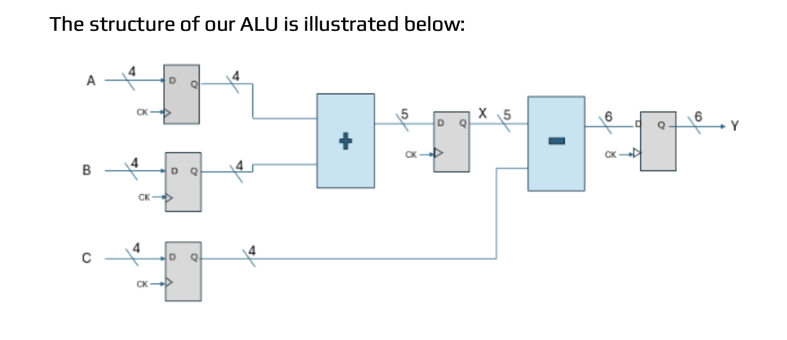

**4-Bit Register Sub-Module (D-Flip-Flops):**
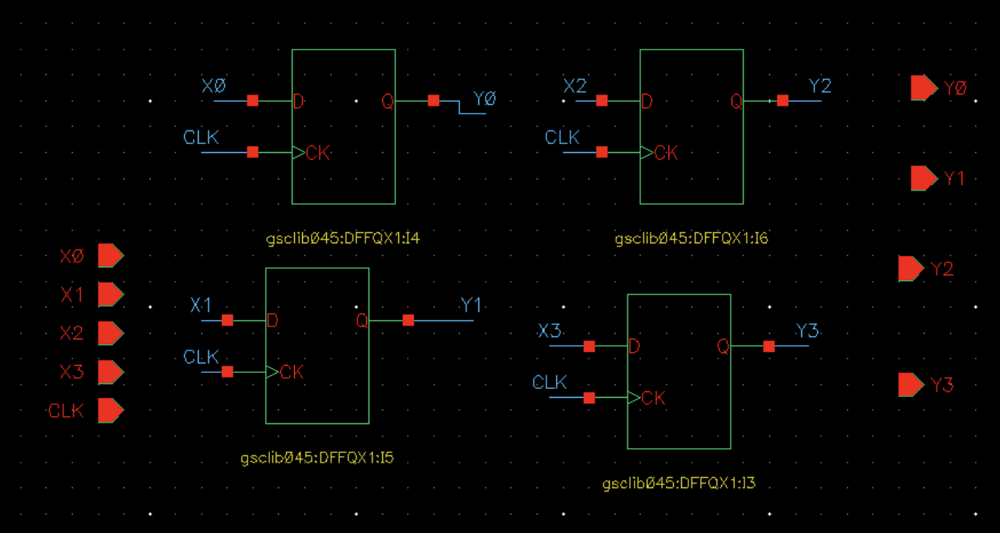

**Virtuoso Top-Level Schematic:**
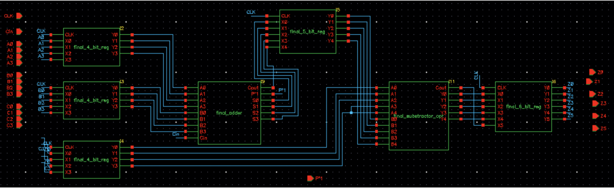

### ⚡ The Kogge-Stone Adder (KSA) Architecture
The core of our arithmetic operations relies on a 4-bit Kogge-Stone Adder. The KSA is a parallel prefix carry look-ahead adder, renowned for being one of the fastest topologies for high-performance VLSI designs. 

Unlike standard Ripple Carry Adders (which have a linear latency), the KSA computes the carry signals for all bit positions in parallel, achieving a logarithmic latency of O(log2 N). Its defining advantage over other prefix trees (such as Sklansky) is a **constant, low fan-out of 2** at every stage. This ensures uniform signal driving capabilities and faster transition times, making it ideal for high-speed arithmetic.

**KSA Conceptual Logic & Legend:**
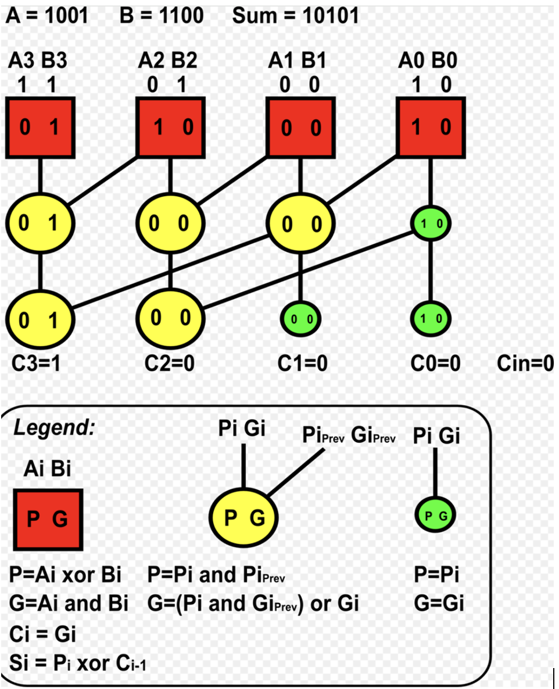

The KSA operation is divided into three distinct computation stages:
1. **Pre-Processing:** Generates the initial Propagate and Generate signals for each bit.
2. **The Prefix Tree:** Computes the carry signals in parallel. For our 4-bit adder, the tree depth is exactly 2 levels. The tree is constructed using two types of logic cells:
   * **Black Cells:** Calculate both the Group Generate and Group Propagate signals.
   * **Grey Cells:** Calculate only the Group Generate signals.
3. **Post-Processing:** Calculates the final Sum bits using an XOR operation between the propagate signal and the previous carry.

**Pre-Processing Cell (Schematic & Layout):**
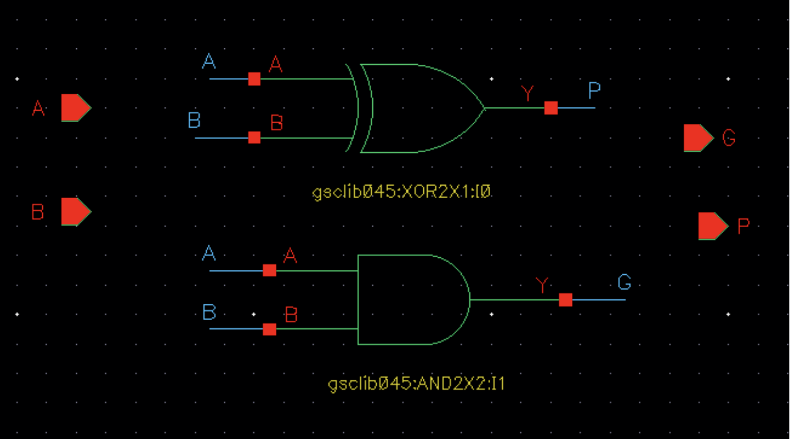
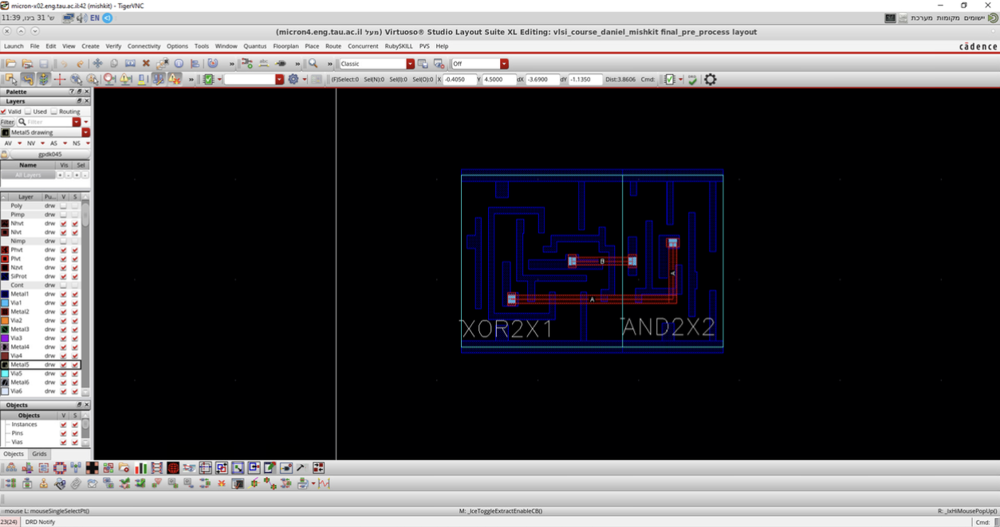

**Black Cell (Schematic):**
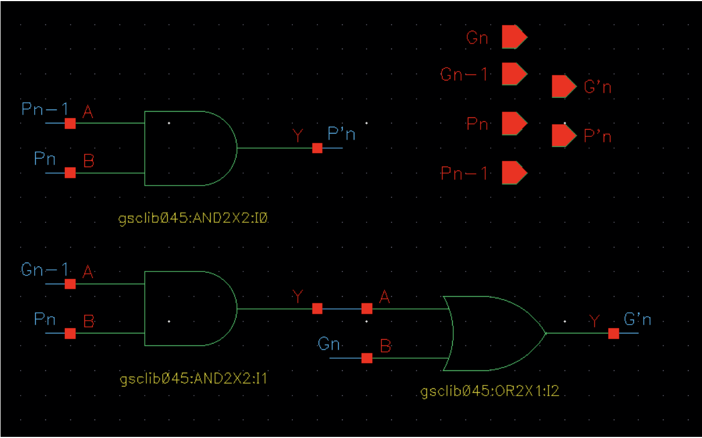

**Grey Cell (Schematic & Layout):**
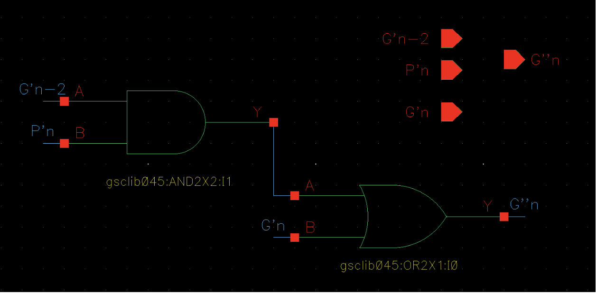
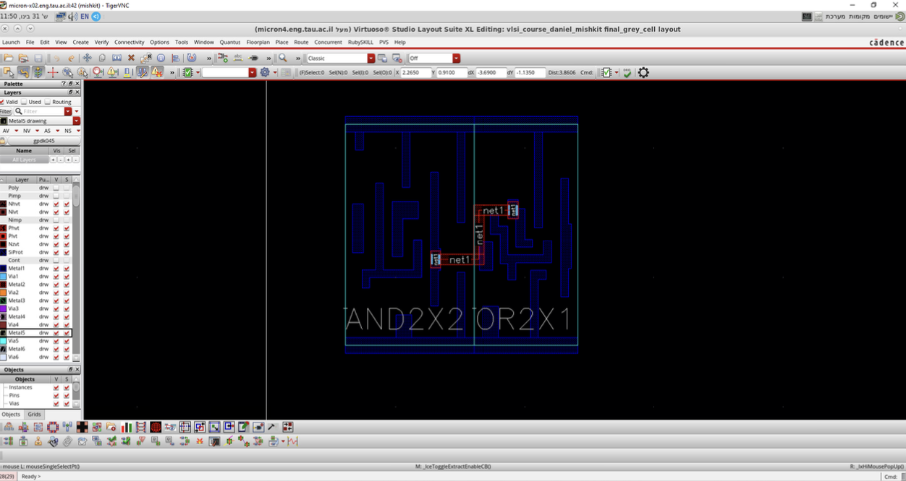

**Kogge-Stone Tree Diagram:**
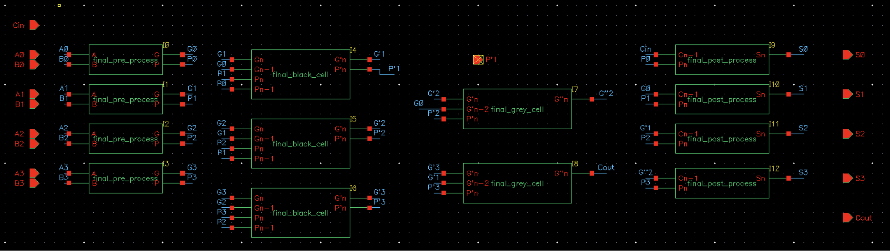

### 🧠 Data Path, Signed Arithmetic, and the Borrow Flag ($C_{out}$)
Handling Two's Complement subtraction optimally requires careful interpretation of the output flags. The subtraction $X - C$ is mathematically implemented as $Y = X + \sim C + 1$. 

Our hardware produces a 5-bit data bus $Y[4:0]$ and a Carry-Out flag ($C_{out}$) from the final prefix adder. We intentionally applied a logical Inverter (NOT gate) to the final carry-out bit, transforming $C_{out}$ into an **active-high Borrow indicator**:

* **Negative Result ($C_{out} = 1$):** Indicates $X < C$ (a borrow was required). The internal adder did *not* produce a carry, which we invert to '1'. The value on $Y[4:0]$ is the precise negative integer in Two's Complement.
* **Positive/Zero Result ($C_{out} = 0$):** Indicates $X \ge C$ (no borrow required). The result is positive, and the 5th bit (MSB) acts merely as a residual internal carry that can be discarded. The absolute magnitude is read directly from the lower 4 bits.

### ⚙️ Hardware Optimization (Dead Logic Elimination)
To optimize area and delay, we did not treat the subtractor's $C_{in}$ as a variable input. Since $C_{in}$ is constantly tied to Logic '1' ($V_{DD}$), we optimized the first stage of the subtractor's prefix tree:
1. **Generate Logic:** $G_{new} = G_0 + (P_0 \cdot C_{in})$ simplified to $G_0 + P_0$, eliminating an AND gate.
2. **Sum Logic:** $Y_0 = P_0 \oplus C_{in}$ simplified to $NOT(P_0)$, replacing an XOR gate with a smaller Inverter.
3. **Black to Grey Cell:** We converted the first stage's Black Cell into a Grey Cell by removing dead Propagate calculation logic entirely.

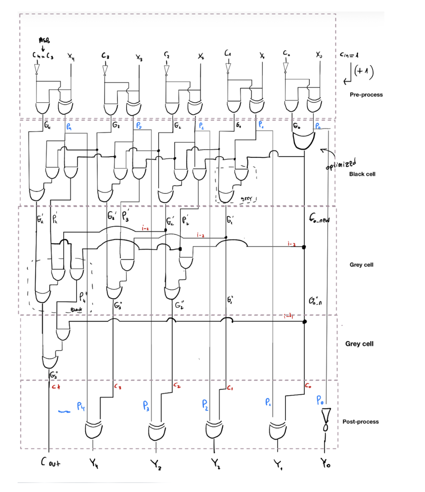

**Virtuoso Implementation of the Optimized Subtractor:**
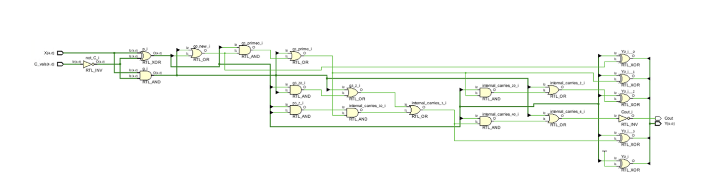

### 🧪 Simulation & Verification
The integrated ALU design, implementing the logic Y = (A + B) - C using Two's Complement arithmetic, was verified via exhaustive simulation covering all 4,096 possible input combinations. Below is a detailed analysis of two distinct test cases extracted from our simulation waveforms, demonstrating the circuit's correct behavior for both negative and positive results:

#### Case 1: Negative Result Verification
* **Scenario:** `A = 1011` (-5), `B = 1100` (-4), `C = 1111` (-1, sign-extended).
* **Expected Calculation:** `(-5) + (-4) - (-1) = -8`.
* **Observed Output:** * `C_out = 1`: The carry-out flag is high, correctly acting as an active-high "Borrow" indicator. This signifies that the result is negative.
  * `Y = 11000`: In Two's Complement, the sequence 11000 perfectly represents -8, confirming the correct operation of the subtractor.

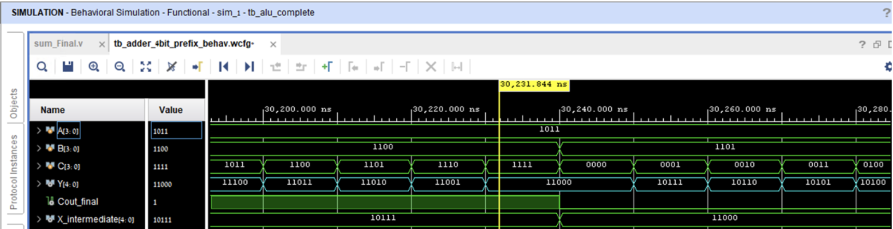

#### Case 2: Zero Result and MSB Handling
* **Scenario:** `A = 0110` (6), `B = 1011` (-5), `C = 0001` (1).
* **Expected Calculation:** `(6) + (-5) - (1) = 0`.
* **Observed Output:** * `C_out = 0`: The flag is low, indicating a positive/zero result (no borrow).
  * `Y = 10000`: While the 5th bit is '1', our interpretation rule states that when `C_out = 0`, the valid magnitude is contained entirely within the lower 4 bits. The lower 4 bits are `0000` (Decimal 0), and the 5th bit is merely a residual internal carry that is correctly discarded.

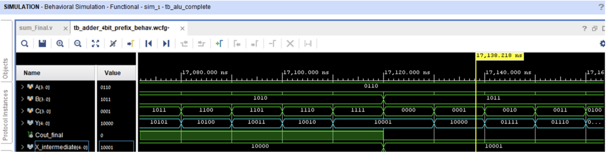

### 📐 Layout & Physical Verification
The final layout was structured hierarchically utilizing standard cells (`gsclib045`). The design passed all manufacturing rules and connectivity checks.
* **Estimated Area:** $345.394 \mu m^2$.
* **DRC:** 0 Errors.
* **LVS:** Clean match between schematic and layout.

**Area Estimation Breakdown:**
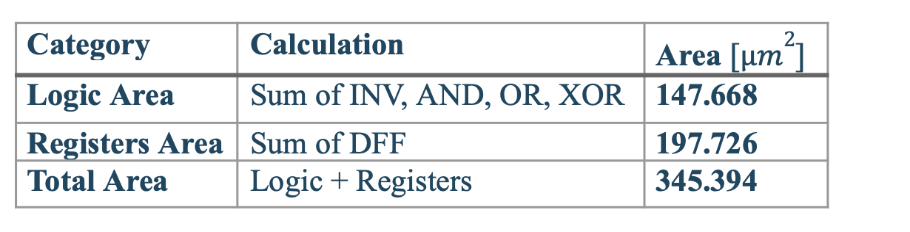

**Adder Core Layout:**
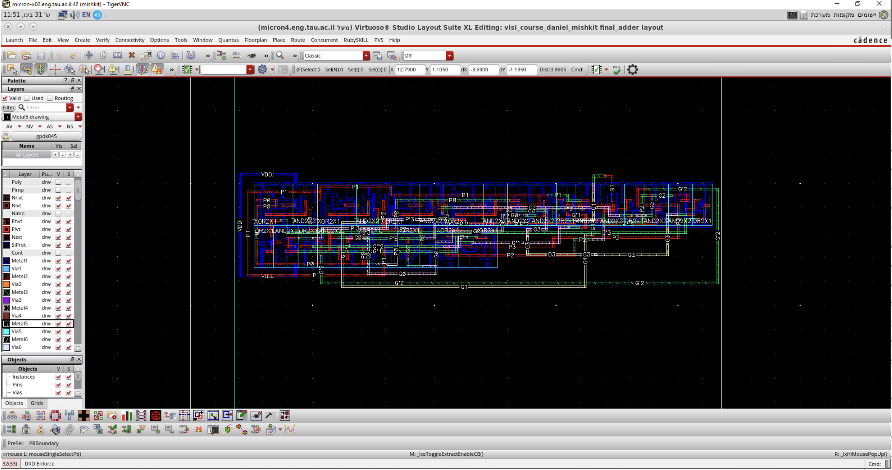

**Clean DRC & LVS Reports:**
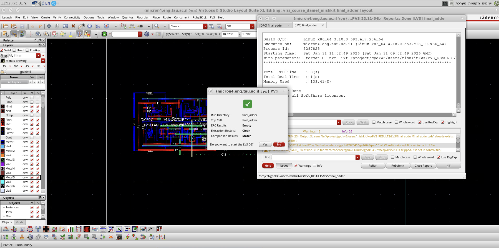

### 📝 Part 1 Conclusion & Summary
The 4-bit ALU project successfully demonstrated a full custom digital design flow. By implementing a Kogge-Stone Adder and an optimized Two's Complement subtractor, we achieved a high-speed arithmetic unit. Exhaustive simulations verified the correct handling of all 4,096 input combinations, including edge cases with negative results and sign extensions. Finally, the physical layout was carefully routed and passed all DRC and LVS checks, resulting in a fully verified, silicon-ready design with an estimated area of 345.394 µm².

---

## 🔄 Part 2: Ring Oscillator Design

### 🎯 Requirements
Design a clock generation circuit using a Ring Oscillator topology to achieve an oscillation frequency of $f_{osc} = 2.5MHz$. The design must account for added RC chains and a $100fF$ load capacitor representing a clock network.

### 🔬 Implementation & Tuning
The fundamental oscillator frequency is defined by $f_{osc} = \frac{1}{2 \cdot t_d \cdot n}$. 

1. **Initial Design:** We built a 5-stage inverter chain using `INVX1` cells. By tuning the RC chains, we achieved a stable oscillation frequency of **2.492MHz**, closely matching the requirement.
2. **Load Testing:** Adding the $100fF$ load capacitor dropped the frequency to $2.44MHz$, attenuated the signal edges, and prevented the signal from reaching full rail-to-rail swings (0V to 1.2V). This indicated the `INVX1` drive strength was insufficient for the capacitive load.
3. **Optimization:** Upgrading the cells to `INVX2` significantly increased drive strength. This restored sharp edges, returned the signal to full rail-to-rail capacity, and successfully elevated the frequency back up to a stable operating point.

**Ring Oscillator Schematic:**
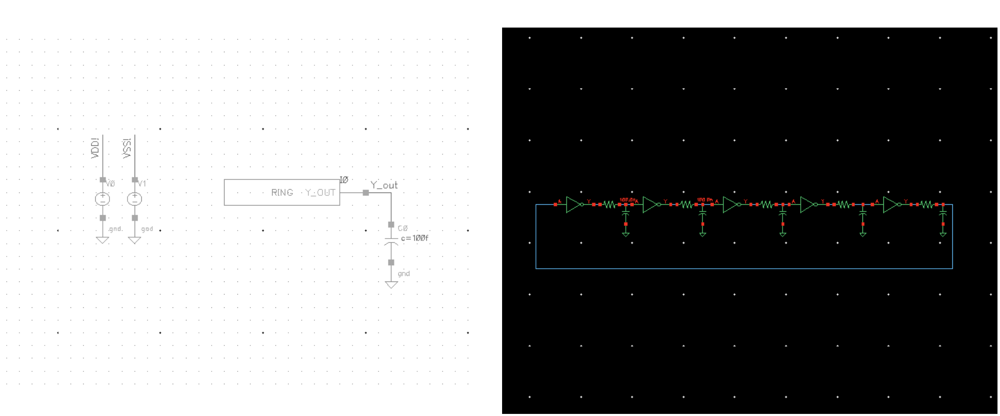

**Transient Response (Target 2.5MHz):**
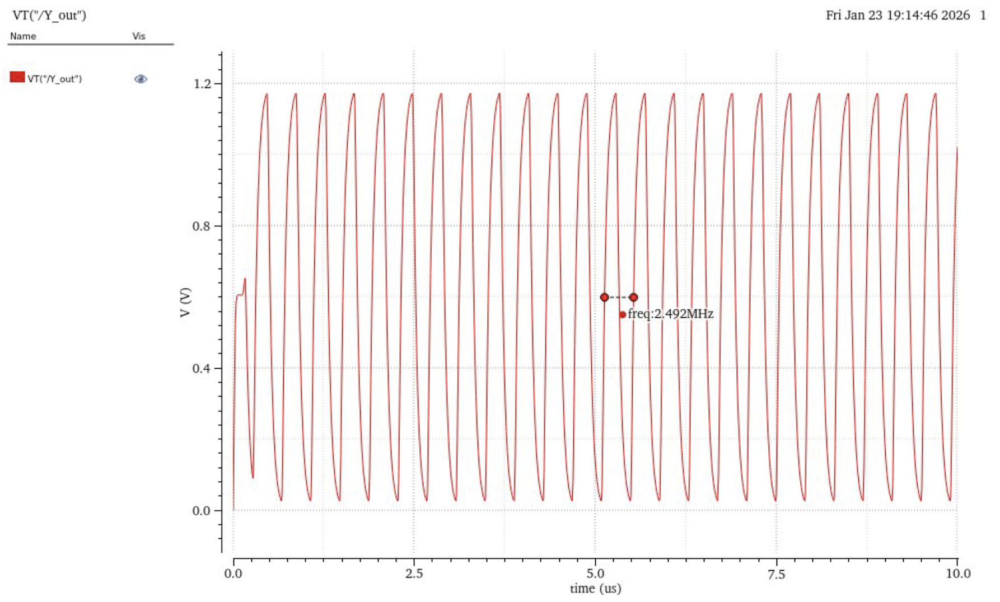

### 📝 Conclusion & Summary
The Ring Oscillator project successfully demonstrated the principles of custom clock generation in a 45nm standard cell environment. We met the 2.5MHz target frequency (achieving ~2.49MHz) through careful tuning of the RC chains. Furthermore, the project highlighted a crucial VLSI design consideration: **drive strength**. By simulating a real-world clock network load (100fF capacitor), we observed signal degradation and frequency drop, which we successfully resolved by resizing our gates from `INVX1` to `INVX2`. This effectively restored sharp rail-to-rail swings and proved the circuit's resilience under load.
